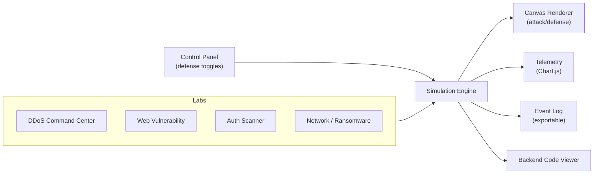

# STA_ShieldCore


> A multi-vector cybersecurity sandbox that **simulates** seven real attack classes — each with live defense controls, real-time Canvas visualizations, and telemetry dashboards. Built to teach how attacks look and how defenses respond, in one self-contained playground.

<!-- Replace this line with a screenshot or GIF of the dashboard: -->
<!--  -->

## Highlights

- **7 attack vectors** in 4 tabbed labs, each with its own defense toggles
- **Real-time Canvas** attack/defense animation per vector
- **Chart.js telemetry** with live metrics and log export
- **Dynamic backend code viewer** — inspect the logic behind each attack type
- Glassmorphism dark UI with a cyber boot-screen intro

## Attack Vectors

| Vector | Lab | Live Defense Control |
|---|---|---|
| DDoS | Command Center | Botnet size + intensity tuning, rate limiting |
| SQL Injection | Web Vuln Sandbox | Input sanitization / parameterized queries |
| XSS | Web Vuln Sandbox | Output encoding, CSP toggle |
| CSRF | Web Vuln Sandbox | Token validation |
| Brute Force | Auth Scanner | Lockout + throttling |
| MitM | Network Topology | Traffic interception view |
| Ransomware | Network Topology | Node isolation / containment |

## Architecture



## Run

```bash
# static front end — just serve the folder
python -m http.server 8000
# then open http://localhost:8000
```

## Tech Stack

`HTML5` · `CSS3` · `JavaScript` · `Canvas API` · `Chart.js` · `Python`

## ⚠️ Disclaimer

Everything here is **simulated for education**. No real traffic is generated, no live systems are targeted, and no exploit payloads are executed against external hosts. Do not repurpose any concept here against systems you don't own.

## License

MIT
